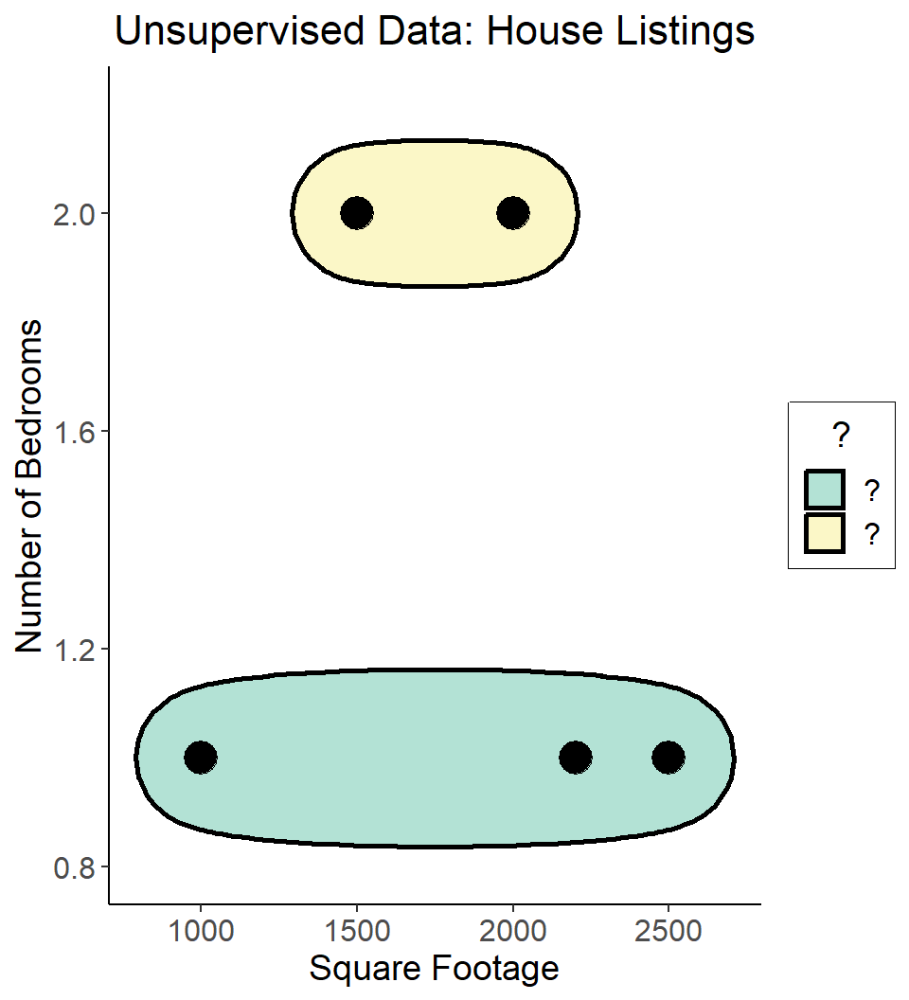

## Supervised vs. Unsupervised Learning

-   **Supervised** Learning: You want the computer to learn the pattern of how *you* are classifying[^1] observations in a dataset
    -   Discovering the relationship between *properties* of observations and *outcomes*
    -   Example (*Binary Classification*): I go through Craigslist looking for used cars, saving the ones I like to one folder and ones I don't like to another
    -   Example (*Regression*): I assign a score from 0-100 to each used car, bassed on how much I like them
-   **Unsupervised** Learning: You want the computer to *figure out* patterns within a dataset, without any predetermined inferences you want it to make
    -   Typically: grouping or clustering observations based on shared properties
    -   Example: I save all the used car listings I can find, and ask the computer to "find a pattern" in this data
    -   ["Exploratory" Data Analysis](https://www.ibm.com/topics/exploratory-data-analysis)

[^1]: Encompassing both standard classification (sorting each observation into a set number of bins) and regression (assigning a real number to each observation)

## Dataset Structures

-   **Supervised** Learning: Dataset has both *explanatory* variables [("features")]{.colA} and *response* variables [("labels")]{.colB}

::: {.cell layout-align="center"}

:::

::: suptable

::: {.cell layout-align="center"}
::: {.cell-output-display}

| home_id| sqft| bedrooms|liked |
|-------:|----:|--------:|:-----|
|       0| 1000|        1|FALSE |
|       1| 2000|        2|TRUE  |
|       2| 2500|        1|TRUE  |
|       3| 1500|        2|FALSE |

:::
:::

:::

-   **Unsupervised** Learning: Dataset has only *explanatory* variables

::: {.cell layout-align="center"}

:::

::: unsuptable

::: {.cell layout-align="center"}
::: {.cell-output-display}

| home_id| sqft| bedrooms|
|-------:|----:|--------:|
|       0| 1000|        1|
|       1| 2000|        2|
|       2| 2500|        1|
|       3| 1500|        2|

:::
:::

:::

## Dataset Structures

:::: {.columns}

::: {.column width="50%"}

::: {.cell layout-align="center"}
::: {.cell-output-display}
{fig-align='center' width=480}
:::
:::

:::

::: {.column width="50%"}

::: {.cell layout-align="center"}
::: {.cell-output-display}
{fig-align='center' width=480}
:::
:::

:::

::::

## Different Goals

:::: {.columns}

::: {.column width="50%"}

::: {.cell layout-align="center"}
::: {.cell-output-display}
{fig-align='center' width=480}
:::
:::

:::

::: {.column width="50%"}

::: {.cell layout-align="center"}
::: {.cell-output-display}
{fig-align='center' width=480}
:::
:::

:::

::::

## Cross-Validation

## Model

## Loss Functions and Error Measures

## Regularization

## Numerical Optimization

## Hyperparameter Tuning

## Prediction

## Lab

## Q & A

